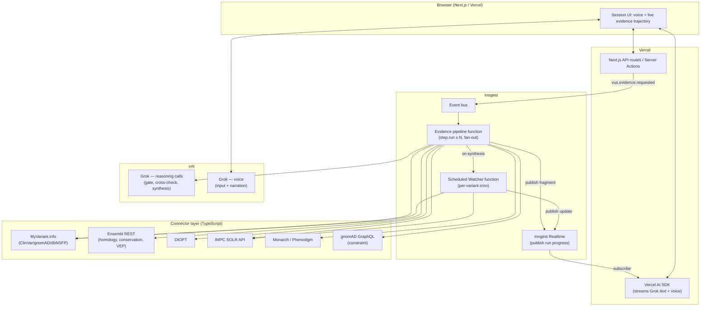
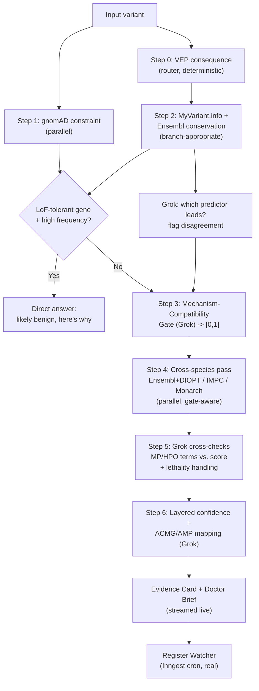
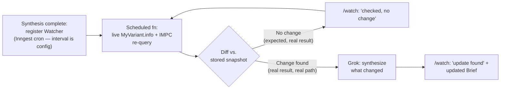

# VUS Resolver — Unified Architecture v2

This supersedes the original architecture by folding in the bio-side
hardening addendum and adding the piece that was previously underspecified:
the frontend. The orchestration spine — Inngest pipeline, parallel fan-out,
Grok-at-each-decision-point, the Watcher — is unchanged and sound. What
changes: the evidence the agent gathers is now layered and mechanism-aware
rather than a flat three-term blend, every evidence source is a real public
API with no local stub data, and the frontend is specified down to routes,
components, and the realtime data path that makes the "watch the agent think"
demo moment actually work.

**Hard constraint carried through this entire revision: no mocked API
responses, no local fallback data, no simulated events.** Where a real-time
process (the Watcher) has a natural cadence longer than a demo window, the
fix is an accelerated schedule against live APIs — not a fake payload. This is
addressed explicitly in [The Watcher, Honestly](#the-vus-watcher-subsystem).

## Core Loop (revised)

```text
InputVariant (HGVS / rsID / VCF line)
  -> Variant-Type Router (VEP consequence) -> branch:
       missense | predicted-LoF | splice/intronic | in-frame indel/start/stop-loss

  -> Gene-Level Prior  (gnomAD constraint: LOEUF / pLI / mis-z)
  -> Variant-Effect Pass (branch-appropriate: AlphaMissense | SpliceAI | dbNSFP consensus
                          + per-residue conservation)
  -> Mechanism-Compatibility Gate (Grok, grounded in consequence + effect scores
                                    + known gene mechanism)  -> gate in [0,1]

  [VUS branch, gate > 0]
    -> Cross-Species Pass:
         Ensembl + DIOPT orthology  -> ortholog_quality
         IMPC (zygosity-matched, lethality-aware)  -> mouse phenotype (MP terms)
         Monarch/Phenodigm  -> MP<->HPO similarity score
    -> Grok cross-checks: does the computed similarity score match what the
       actual MP/HPO terms say? Any predictor disagreement to flag?

  -> Layered Confidence Synthesis (Grok) -> low/moderate/high + ACMG/AMP mapping
  -> Evidence Card + Doctor Brief, streamed live to frontend
  -> Register VUS Watcher (Inngest scheduled function, real cadence)
```

Every box above is a real API call or a Grok reasoning call grounded in the
results of real API calls. Nothing is precomputed or cached locally beyond the
duration of a single run.

## System Architecture Overview



## Boundaries

- **Next.js / Vercel** owns the UI, the voice session lifecycle, and the
  Server Actions that emit Inngest events and subscribe to Inngest Realtime
  channels. Nothing here calls a genomics API directly — it talks to Inngest
  and to Grok only.
- **Inngest** owns every external data fetch (as durable `step.run()` calls),
  the fan-out structure of the evidence pipeline, the per-variant scheduled
  Watcher function, and the Realtime channel that streams fragment-by-fragment
  progress to the frontend.
- **Connector layer** (plain TypeScript modules called from inside Inngest
  steps) owns API-shape normalization only — each returns an `EvidenceFragment`
  (schema below) and nothing more. No connector ever returns synthetic data;
  a failed or empty real query is itself a valid `EvidenceFragment` with
  `found: false`.
- **Grok (xAI)** owns all reasoning: the variant-type routing confirmation, the
  mechanism-compatibility gate, the cross-species sanity-check, predictor
  disagreement flagging, and final synthesis — plus the entire voice layer.
- **Cursor** is dev-time only, scaffolding the now-larger connector set (seven
  sources) and the frontend component library in parallel.

## The Research Loop, Revised

### Step 0 — Variant-Type Router

A single Ensembl VEP call returns the consequence type. This is a router, not
a Grok call — it's a deterministic dispatch that decides which downstream
connectors are even relevant (per addendum §6). A splice variant doesn't need
AlphaMissense; a missense variant doesn't need SpliceAI. This keeps the
pipeline from wastefully fanning out to sources that can't say anything useful
for this variant type — and it's the first thing the UI shows the user
("this is a missense variant, so I'm checking AlphaMissense and conservation
first").

### Step 1 — Gene-Level Prior (parallel with Step 0)

gnomAD GraphQL constraint query for the gene: LOEUF, pLI, missense-z. This is
fired immediately and in parallel with the router, since it doesn't depend on
the variant's consequence type — it's a property of the gene. Grok holds this
in context for every later step as the "does this gene matter" prior. If the
gene is LoF-tolerant *and* the variant is high-frequency (gnomAD per-variant,
fetched in the same pass via MyVariant.info), the agent can early-exit here —
the same early-exit as the original design, now on firmer footing.

### Step 2 — Variant-Effect Pass (branch-dependent, fan-out)

One MyVariant.info call returns ClinVar status, population frequency, and the
full dbNSFP bundle (AlphaMissense, REVEL, CADD, EVE, SpliceAI) in a single
round trip — this is the aggregator from addendum §2, used as primary rather
than optional, since it collapses three connectors into one without losing any
field. A separate Ensembl call gets per-residue conservation. Both fire in
parallel.

Grok's first real reasoning call happens here: given the router's consequence
type, *which* of the returned predictor scores is the relevant headline
number (AlphaMissense for missense, SpliceAI delta for splice-region), and do
the secondary predictors (REVEL, CADD, EVE) agree with it? Disagreement among
predictors is surfaced as its own flagged fact in the evidence trajectory —
not resolved silently, because predictor disagreement is itself meaningful
information for a clinician.

### Step 3 — Mechanism-Compatibility Gate (Grok)

This is the load-bearing reasoning call from addendum §1. Inputs: consequence
type (Step 0), variant-effect scores and conservation (Step 2), and — where
available — the gene's known disease mechanism (a small curated lookup table:
some genes are documented LoF-only, GoF-only, or both; this table is loaded
from a static reference dataset, not invented per-run). Grok outputs a gate
value in `[0,1]` *with stated reasoning*, e.g.: "predicted loss-of-function
(nonsense, high CADD, LoF-intolerant gene) → gate = 1.0, mouse knockout
phenotype is directly applicable" or "missense at a non-essential domain with
ambiguous AlphaMissense score, and this gene's disease mechanism is documented
as gain-of-function → gate = 0.1, a loss-of-function mouse model is unlikely to
be informative regardless of what its phenotype shows."

This gate value is computed **before** the cross-species pass runs, and is
shown to the user immediately — so if the gate is near zero, the UI can
honestly say "checking the mouse data anyway for completeness, but flagging
upfront that it's unlikely to be informative for this variant" rather than
building suspense toward evidence that was never going to count.

### Step 4 — Cross-Species Pass (fan-out, gated)

Three parallel calls, all real:

- **Ensembl homology + DIOPT** — ortholog identification and a multi-method
  confidence rank (addendum §8), plus percent sequence identity.
- **IMPC**, queried with **zygosity matched to the gene's inheritance mode**
  (read from the same curated mechanism table used in Step 3 — a gene
  documented as autosomal dominant pulls heterozygous KO data; recessive pulls
  homozygous). If the IMPC record reports `viability: lethal`, this is
  retrieved and tagged as a high-weight signal (addendum §7), not as "no
  phenotype found."
- **Monarch/Phenodigm** — computes MP↔HPO similarity. The HPO side is derived
  from the clinical context the patient/voice session provided (e.g., the
  panel the variant came from maps to a small set of HPO terms via a static
  panel→HPO lookup).

### Step 5 — Grok's Cross-Species Sanity Check

This is the step that directly answers "Grok agents still checking mouse to
human, not just trusting computed scores." Monarch returns a similarity
*number*, but Grok is given the **actual MP terms and HPO terms**, not just
the score, and is asked: does this number make sense given what these specific
terms actually describe? Two concrete failure modes this catches:

- **Score inflation from broad terms.** Ontology similarity can score
  moderately well between a very broad MP term ("abnormal homeostasis") and a
  specific HPO term just because of ontology structure, without the match
  being clinically meaningful. Grok reading the actual term text catches this
  in a way a bare number can't.
- **Lethality miscounted as "no similarity."** If the IMPC record is
  `lethal`, there's no adult MP term to compare, so a naive Monarch score would
  be near zero — but per addendum §7, lethality on KO is itself strong
  evidence of essentiality. Grok is explicitly told to treat `viability: lethal`
  as a high-confidence essentiality signal *independent of* the Monarch score,
  not as "the cross-species similarity check returned nothing."

Grok's output at this step is a short narrated verdict — "the computed
similarity is 0.62, and looking at the actual terms (mouse: 'abnormal cardiac
muscle contractility'; human: 'hypertrophic cardiomyopathy') this is a
genuinely close match, not an ontology-structure artifact" — which becomes
part of the evidence trajectory and is what the voice layer reads back to the
patient.

### Step 6 — Layered Confidence Synthesis

```text
gene_prior         = f(LOEUF, pLI, missense_z)
variant_effect     = f(AlphaMissense | SpliceAI, REVEL/CADD/EVE agreement,
                       conservation_at_residue)
mechanism_gate     = Step 3 output, in [0,1]
cross_species_raw  = f(ortholog_quality [Ensembl+DIOPT+%identity],
                       monarch_similarity, lethality_signal)
cross_species      = mechanism_gate * cross_species_raw     # gated, per addendum §5

overall            = combine(gene_prior, variant_effect, cross_species)
                     -> low / moderate / high
```

Grok performs this final synthesis call with the full trajectory in context
and produces: the overall rating, a one-line reason for each layer's
contribution (including explicitly stating when `mechanism_gate` suppressed
the mouse evidence and why), the ACMG/AMP mapping table (addendum §9), the
Evidence Card narrative, and the Doctor Brief.



## Data Sources & Connectors (full table)

| Source | Endpoint | Provides | Pipeline step |
|---|---|---|---|
| Ensembl REST (VEP) | `rest.ensembl.org/vep/...` | Consequence type | Step 0 |
| gnomAD GraphQL | `gnomad.broadinstitute.org/api` | Gene constraint (LOEUF/pLI/mis-z) | Step 1 |
| MyVariant.info | `myvariant.info/v1/variant/` | ClinVar, gnomAD freq, dbNSFP (AlphaMissense, REVEL, CADD, EVE, SpliceAI) | Step 2 |
| Ensembl REST | conservation tracks | Per-residue conservation | Step 2 |
| (curated static table) | gene mechanism reference | LoF/GoF/both annotation, inheritance mode | Step 3, 4 |
| Ensembl homology + DIOPT | `rest.ensembl.org/homology/...`, DIOPT API | Ortholog identification + confidence rank + % identity | Step 4 |
| IMPC | EBI SOLR API | Zygosity-specific KO phenotype (MP terms), viability | Step 4 |
| Monarch / Phenodigm | Monarch API | MP↔HPO similarity score | Step 4 |
| HPO | ontology lookup | Patient context as HPO terms | Step 4 input |

Every row is a live external call inside an Inngest `step.run()`. The only
non-API input is the small curated gene-mechanism/inheritance reference table
— this is reference data (analogous to a code constant, like the ACMG
criteria table itself), not a fallback for a failed query.

## Frontend / UI / UX Architecture

### Stack

- **Next.js 14 (App Router)** on **Vercel**, TypeScript throughout.
- **Vercel AI SDK** (`ai` package) for streaming Grok's text/voice responses
  into React via `useChat` / a custom `useObject`-style hook for structured
  evidence fragments.
- **Inngest Realtime** for the live evidence-trajectory feed: the Inngest
  pipeline function publishes each `EvidenceFragment` to a per-run channel as
  soon as that step completes, and the frontend subscribes to that channel —
  this is the mechanism that makes the "watch the investigation happen" UI
  honest rather than a fake progress bar.
- **Tailwind CSS + shadcn/ui** for components; no custom design system needed
  for a one-day build, but the visual language is deliberately clinical/calm
  (muted blues/greens, generous whitespace) rather than "AI demo neon," since
  the subject matter is a real medical result.
- **Grok voice (xAI)** integrated via WebRTC/streaming audio in the browser,
  with transcript shown alongside audio for accessibility and for the live
  trajectory view to stay in sync with what's being said.

### Routes

- **`/`** — Landing + intake. A short explanation of what the tool does, plus
  the input form: paste an HGVS notation / rsID, or upload a small VCF and
  pick which flagged VUS to investigate. Also where the patient's clinical
  context is captured (free-text or a short structured picker mapping to HPO
  terms — e.g., "what kind of panel was this?" → cardiomyopathy, immune,
  neurodevelopmental, etc.), which feeds Step 4's Monarch query.
- **`/session/[runId]`** — The core experience. Two-pane layout:
  - **Left pane: Conversation.** The Grok voice/text interface. Patient can
    talk or type. This pane also renders the running narration Grok produces
    at each step (Step 3's gate explanation, Step 5's sanity-check verdict).
  - **Right pane: Evidence Trajectory.** A vertically-stacked list of cards,
    one per `EvidenceFragment`, that populate in real time via the Inngest
    Realtime subscription. Each card shows: source name/icon, one-line
    summary, and a small inline value (e.g., "AlphaMissense: likely
    pathogenic (0.87)"). Cards for steps that haven't run yet are shown as
    placeholders in a "queued" state, so the user sees the *plan* up front
    (this is where the Step 0 router's output matters — the queued list is
    different for a missense vs. a splice variant, visibly).
  - A persistent **Confidence Pipeline strip** at the top of the right pane:
    four labeled segments — Gene Prior, Variant Effect, Mechanism Gate,
    Cross-Species — each filling in with a value and a color (gray = pending,
    then amber/blue/green for low/moderate/high) as its step resolves. The
    Mechanism Gate segment is visually distinct (e.g., shown as a "valve" icon)
    since it's a multiplier, not an additive term — this is the single most
    important visual for explaining the bio-side hardening to a judge at a
    glance.
- **`/brief/[runId]`** — The Doctor Brief, rendered as a clean, printable/
  shareable page: the plain-language summary, the confidence rating with
  per-layer breakdown, the ACMG/AMP evidence-code table (addendum §9, rendered
  as an actual small table — codes in one column, the supporting fact in the
  other, with the PS3-framing caveat shown verbatim where applicable), and a
  "what would change this" line when confidence is low. Includes a share/
  download action (PDF export via a simple print stylesheet — no extra
  service needed).
- **`/watch`** — The Watcher dashboard: a list of variants currently
  registered for recurring re-checks, each showing last-checked timestamp and
  result ("no change" / "update found, see brief"). This is also where the
  accelerated-cadence demo configuration is visible (see next section) —
  showing the actual Inngest cron schedule for each registration is itself
  part of the credibility story.

### Live Data Path (frontend perspective)

1. User submits a variant on `/`. A Server Action emits `vus.evidence.requested`
   to Inngest and redirects to `/session/[runId]`.
2. `/session/[runId]` opens an Inngest Realtime subscription scoped to
   `runId` on mount.
3. As each pipeline step completes, the Inngest function publishes
   `{ type: "fragment", data: EvidenceFragment }` or `{ type: "narration",
   data: string }` to that channel.
4. The frontend's subscription hook appends fragments to the Evidence
   Trajectory list and updates the Confidence Pipeline strip; narration
   events are pushed into the Grok voice/text conversation pane and, if voice
   is active, spoken aloud via Grok's voice output.
5. On `Step 6` completion, the pipeline publishes a final `{ type: "complete",
   briefUrl }` event; the frontend surfaces a "View your Doctor Brief" action
   linking to `/brief/[runId]`, and separately confirms Watcher registration.

This is a single, real data path — there is no separate "demo mode" branch in
the frontend code.

## Sponsor Tool Integration

### xAI / Grok — five distinct reasoning roles, plus voice

1. **Predictor-leadership + disagreement flagging** (Step 2) — decides which
   in-silico score is the headline number for this variant type and surfaces
   disagreement among predictors as a first-class fact.
2. **Mechanism-Compatibility Gate** (Step 3) — the addendum's central
   contribution, computed as a grounded reasoning call over consequence type,
   effect scores, and known gene mechanism.
3. **Cross-species sanity check** (Step 5) — reads the actual MP/HPO terms
   behind the Monarch score and either confirms or qualifies it, and handles
   the lethality-as-signal case explicitly.
4. **Layered synthesis + ACMG/AMP mapping** (Step 6) — composes the final
   rating, per-layer reasoning, and the Evidence Card / Doctor Brief text.
5. **Voice layer** — bidirectional throughout the session: transcribes patient
   speech, narrates each step's result as it streams in, and answers
   follow-up questions ("why didn't the mouse data count for much here?")
   directly from the in-context evidence trajectory and gate reasoning —
   no re-querying needed, since the gate's stated reason from Step 3 is
   already in context.

Every Grok call is narrow and grounded in specific retrieved fields passed in
the prompt — never a single end-to-end "figure out if this variant is bad"
call. This is what keeps the reasoning auditable and is the direct answer to
"Grok agents still being used in the research phase, checking mouse-to-human
in addition to computed scores": Grok is never just reporting a number, it's
given the underlying terms/fields behind every number and asked to verify the
number is being interpreted correctly in context.

### Vercel

Hosts the Next.js app; the **Vercel AI SDK** is the integration surface for
both Grok text/reasoning streaming and Grok voice, and (if available) routes
through an AI Gateway for unified call logging across the now five-call-per-run
Grok usage. The two-pane `/session` UI and the printable `/brief` page are
both standard Next.js rendering — no exotic Vercel features needed beyond
streaming responses and Server Actions for event emission.

### Inngest

Now doing more real work than in the original design:

- **The full seven-source evidence pipeline** as durable steps with retries —
  more sources means more individually-flaky calls, which is exactly the
  case Inngest's retry semantics are for.
- **Fan-out** at Step 1 (parallel with Step 0) and at Step 4 (three parallel
  cross-species calls).
- **Inngest Realtime** as the live-progress channel powering the Evidence
  Trajectory UI — this is a new, concrete use of an Inngest feature beyond
  the original design's mention of retries/fan-out.
- **The Watcher**, a per-variant scheduled function — see below.

### Cursor

Dev-time scaffolding for: the now seven connector modules (each normalizing to
`EvidenceFragment`), the curated gene-mechanism/inheritance reference table
(structured from public sources like ClinGen gene-disease validity
curations), and the frontend component set (Evidence Trajectory cards,
Confidence Pipeline strip, ACMG table). The component count is large enough
that having Cursor scaffold the shadcn-based component shells while the team
wires up Inngest Realtime subscriptions is a real time-saver, not a token
sponsor mention.

## The VUS Watcher Subsystem, Honestly

The mechanism is unchanged from the original design: on synthesis, register a
per-variant Inngest scheduled function that re-runs the MyVariant.info (for
ClinVar status) and IMPC (for new phenotype annotations) queries and diffs
against the stored trajectory snapshot.

**On the "no mocks" constraint specifically:** a real ClinVar reclassification
will not happen during a demo window, and faking one would violate the
constraint. The honest solution is that the scheduled function's *cadence is a
configuration value*, not its logic — for the demo, registrations use a
short interval (e.g., every few minutes) against the **real, live APIs**. The
overwhelmingly likely outcome on stage is the function running, making real
calls, and reporting "checked again — no change" on the `/watch` dashboard,
which is itself the correct and honest demonstration of the mechanism: the
infrastructure works, runs on schedule, and makes real queries. The "if
something *had* changed" path is the same code, same component, same
real-data path — it's just a second, equally-real branch of a comparison that
happens to be the less likely outcome on any given short interval. This is a
materially different claim than "we'll simulate an update," and it's the one
worth making explicitly to judges: *"this is the actual production code,
running on an actual production mechanism, just polling faster than it would
in real deployment."*



## Output Artifacts (unchanged in shape, enriched in content)

- **Evidence Card** — now includes the Confidence Pipeline breakdown (four
  layers + gate value with stated reason), predictor agreement/disagreement,
  and the lethality-as-signal note where applicable.
- **Doctor Brief** — now includes the ACMG/AMP mapping table from addendum §9
  with the explicit PS3-framing caveat, plus the same "what would change this"
  honesty clause from the original design when confidence is low.

## Demo Variant Selection

Per addendum §10: lead with **KCNQ1** — LoF-intolerant, clean 1:1 mouse
ortholog at high identity, a non-lethal cardiac-conduction IMPC phenotype that
maps cleanly to a long-QT HPO term, and a real ClinVar VUS with a deleterious
AlphaMissense call at a conserved residue. This variant lights up every layer
of the Confidence Pipeline strip in the "everything agrees" configuration.

Pair it with a second variant chosen specifically so the **Mechanism Gate
closes** — a missense VUS in a gene whose documented disease mechanism is
gain-of-function (or in a LoF-tolerant gene), where IMPC nonetheless shows a
strong knockout phenotype. The UI shows the Confidence Pipeline strip with a
visibly strong Cross-Species segment that the Mechanism Gate then suppresses —
"the mouse data here looks dramatic, but the gate is closed because this gene
causes disease by gain-of-function, and a knockout can't tell us anything
about that." This is the single most differentiated moment in the demo: every
other team's tool will treat a strong mouse phenotype as good news, and this
one explains, correctly, why it isn't.
